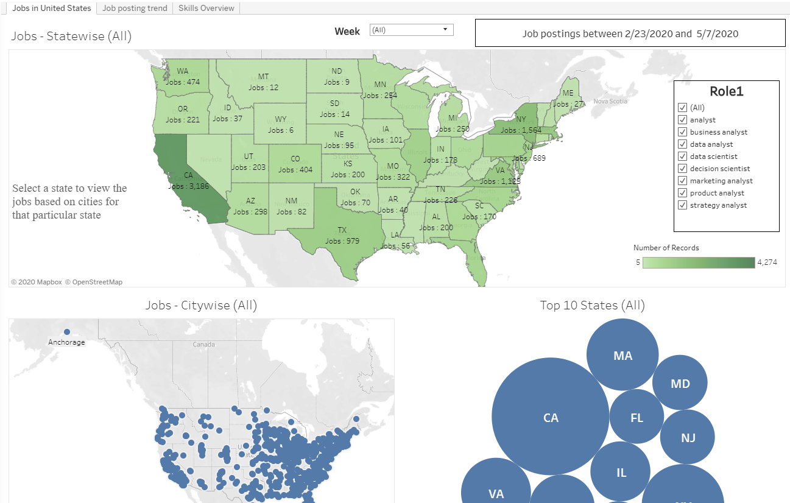
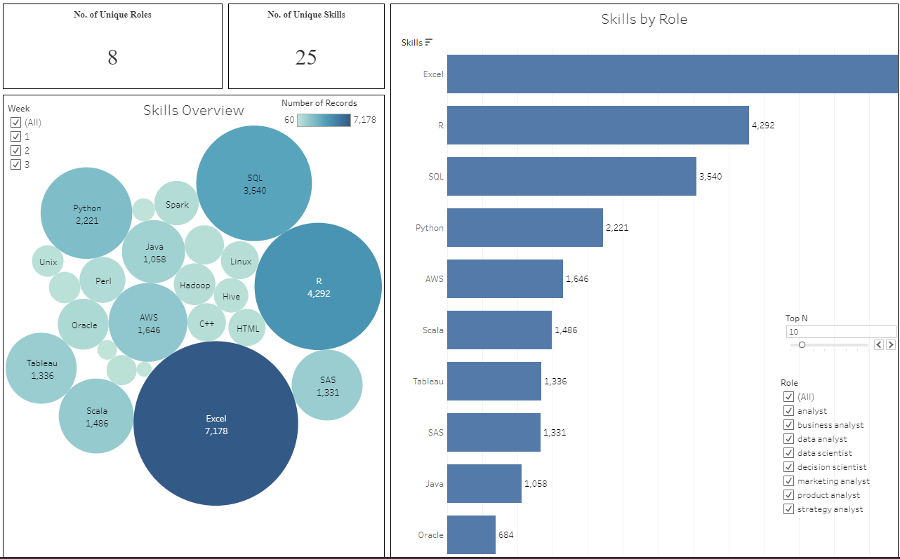

# Job-Insights

To get a better understanding of the Job trends during the current COVID crisis, this script was created to aggregate job postings from online job boards for purely research purposes.

The notebook scrapes upto 3000 of the latest job postings from each of the job boards. 
Features extracted include:
1. Position
2. Company
3. Job location(City, State, Lat/Long)
4. Posting date
5. Job description
6. Industry

Skills are derived from each job by parsing through the job description.
Industry is evaluated by matching company names to an online database of industry information

The notebook, intended to run on a weekly basis, will scrape the results sorted by posting date and for analyst related positions.
The results are used to populate a dashboard to better visualize the job trends.

